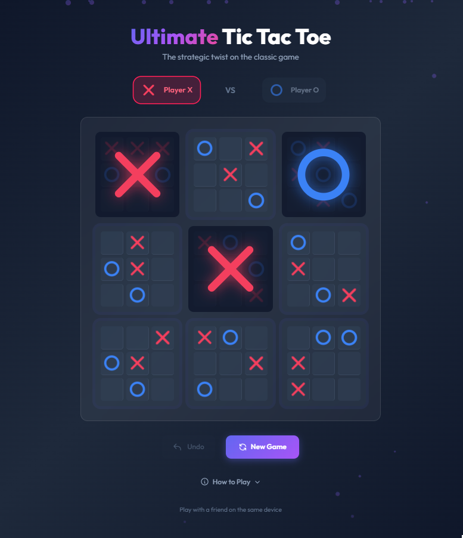
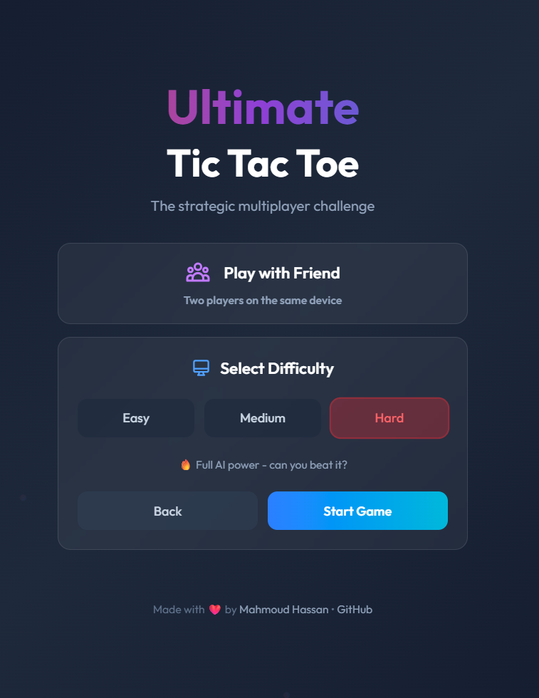

# 🎮 Ultimate Tic Tac Toe

A strategic twist on the classic Tic Tac Toe game built with **React**, **TypeScript**, and **Tailwind CSS**. Challenge the AI or play locally with a friend in this beautiful, animated experience.





## ✨ Features

- **🎯 Strategic Gameplay** - Your move determines which board your opponent plays in next
- **🤖 Computer AI** - Challenge the AI with three difficulty levels (Easy, Medium, Hard)
- **👥 Local Multiplayer** - Play with a friend on the same device
- **✨ Disappearing Mode** - Each player can only have 3 marks per board - oldest marks vanish!
- **🎨 Beautiful UI** - Modern glassmorphism design with gradient effects and animations
- **🎛️ Main Menu** - Choose your game mode, variant, and difficulty from a sleek menu
- **↩️ Undo Moves** - Made a mistake? Take it back!
- **📱 Responsive** - Works on desktop and mobile devices
- **⚡ Fast** - Built with Vite for lightning-fast development and builds

## 🎮 Game Modes

### Classic Mode
Traditional Ultimate Tic Tac Toe rules. Marks stay on the board forever.

### Disappearing Mode ✨
- Each player can only have **3 marks per small board** at a time
- When you place your 4th mark, your **oldest mark disappears**
- Boards can become "unwon" if a winning mark vanishes
- The game never ends in a draw - it keeps going until someone wins!

## 🎲 How to Play

1. **The Board**: The game is played on a 3×3 grid of smaller 3×3 boards
2. **Making Moves**: Each small board is a game of Tic Tac Toe
3. **Strategic Twist**: Where you play in a small board determines which board your opponent must play in next
4. **Winning Small Boards**: Get 3 in a row to win a small board
5. **Winning the Game**: Win 3 small boards in a row (horizontally, vertically, or diagonally)

> 💡 **Tip**: If you're sent to a completed board, you can play anywhere!

## 🚀 Getting Started

### Prerequisites

- Node.js 18+ 
- npm or yarn

### Installation

```bash
# Clone the repository
git clone https://github.com/yourusername/ultimate-tic-tac-toe.git

# Navigate to the project
cd ultimate-tic-tac-toe

# Install dependencies
npm install

# Start the development server
npm run dev
```

Open [http://localhost:5173](http://localhost:5173) in your browser to play!

### Building for Production

```bash
npm run build
```

## 🛠️ Tech Stack

- **React 19** - UI Framework
- **TypeScript** - Type-safe JavaScript
- **Tailwind CSS v4** - Utility-first CSS framework
- **Vite** - Next-generation frontend tooling

## 📁 Project Structure

```
src/
├── components/
│   ├── Cell.tsx           # Individual cell component
│   ├── SmallBoard.tsx     # 3x3 mini board
│   ├── GameBoard.tsx      # Main 3x3 grid of boards
│   ├── MainMenu.tsx       # Game mode & difficulty selection
│   ├── PlayerIndicator.tsx # Shows current player
│   ├── GameControls.tsx   # Undo & Reset buttons
│   ├── Rules.tsx          # Expandable game rules
│   ├── Header.tsx         # Game title
│   └── Particles.tsx      # Animated background
├── hooks/
│   ├── useGameState.ts    # Game logic and state management
│   └── useComputerAI.ts   # AI opponent with minimax algorithm
├── types/
│   └── index.ts           # TypeScript type definitions
├── App.tsx
├── main.tsx
└── index.css              # Tailwind + custom styles
```

## 🎨 Customization

The game uses Tailwind CSS v4's `@theme` directive for easy customization. Edit `src/index.css` to change colors:

```css
@theme {
  --color-game-x: #f43f5e;    /* X player color */
  --color-game-o: #3b82f6;    /* O player color */
  --color-game-board: #1e293b; /* Board background */
}
```

## 📄 License

MIT License - feel free to use this project for learning or building your own games!

## 🤝 Contributing

Contributions are welcome! Feel free to open issues or submit pull requests.

---

<p align="center">
  Made with ❤️ by <a href="https://mhmodhsn.tech">Mahmoud Hassan</a>
</p>

<p align="center">
  <a href="https://github.com/Mhmod-Hsn">GitHub</a> •
  <a href="https://mhmodhsn.tech">Portfolio</a>
</p>
